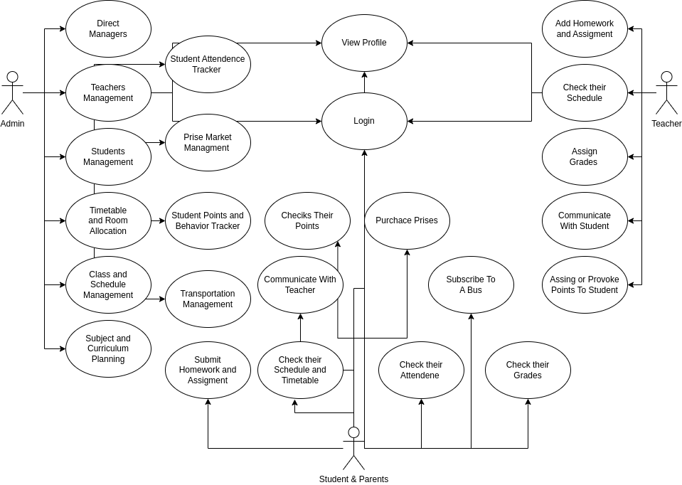
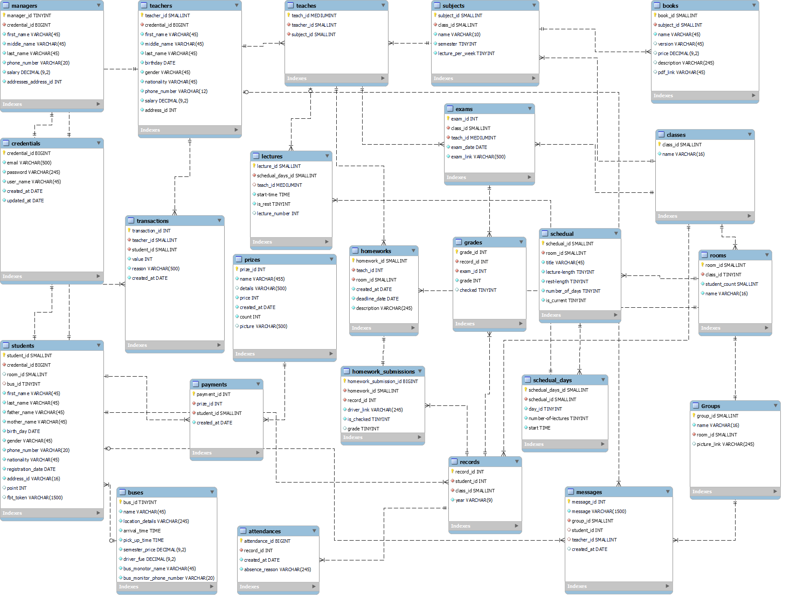
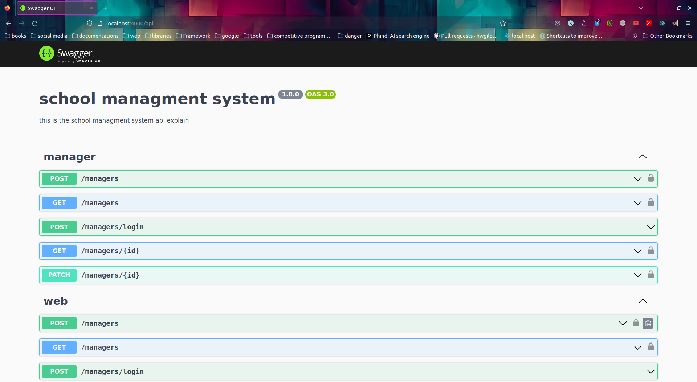
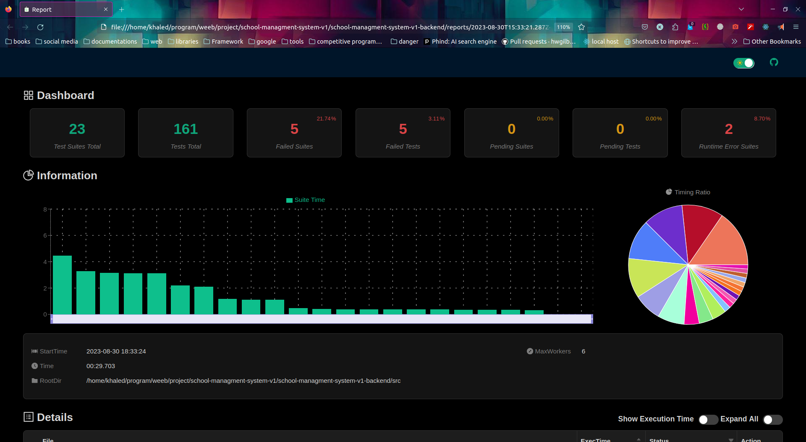

# School Management System

A school management system is a well-equipped and centralized platform that allows teachers, students, and other staff members to interact seamlessly and perform the school functions properly.
Similarly, it helps you automate academic operations and balance workload.

please note this is the repo for the back the repo for the front is

- [web rep](#)
- [phone repo](#)

table of content :

- [Target Audience](#target-audience)
- [Use case Diagram](#use-case-diagram)
- [ERD](#erd)
- [Installation](#installation)
- [Contact](#contact)

## Target Audience

our System is made for :

1. managers and adminsterators of the school
2. the teachers
3. parents and students

## Features

### managers

they can :

1. Direct Managers
2. Manage Teachers
3. Manage Students
4. Timetable and Room Allocation
5. Class and Schedule Management
6. Subject and Curriculum Planning
7. Student Attendence
8. Tracker Prise Market Managment
9. Student Points and Behavior Tracker
10. Transportation Management

### Teachers

1. Add Homework and Assigment
2. Check their Schedule
3. Assign Grades
4. Communicate With Student
5. Assing or Provoke Points To Student

### Students and parents

1. Submit Homework and Assigment
2. Checiks Their Points
3. Communicate With Teacher
4. Check their Schedule and Timetable
5. Purchace Prises
6. Check their Attendene
7. Subscribe To A Bus
8. Check their Grades

## Use case Diagram

and here is a use case diagram :

## ERD

and here is the erd of the project:

## front

here is a over view of the front

you can find the full repo at :

-
-

## Installation

this section contain how to install and run the app :

### prequesties

- first you need node js and npm to be installed in your device "you can check them by running `npm -v` && `node -v`"
- then you will need to have mysql in your machine " you can check that by running `mysql --version`"
  
### set up **done only once**

- open your terminal **and make sure that you are in the root diroctry** and type `npm i` then hit `Enter`
- after that type `npm install -g sequelize-cli`then hit `Enter`
- after that go to your `.env.sample` and rename it to `.env`
- in your `.env` file change your `DB_USER` to your mysql user name and your `DB_PASS` to your mysql password and add the `DB_NAME_DEVELOPMENT` to whatever you want and make sure **the database exists in your mysql**

### to run the program

- open your terminal **and make sure that you are in the root diroctry** and type `npm start` then hit `Enter`
- the app will be running on localhost on port `4000` at the url `http://localhost:4000/`
- then you can go to postman and see the requests (you can find the file inside the extra)
- to see the app route go to `http://localhost:4000/api`

### to run the tests

- in your `.env` file make sure to set `DB_NAME_TEST` to whatever you want and make sure **the database exists in your mysql**
- open your terminal **and make sure that you are in the root diroctry** and type `npm run test:watch` then hit `Enter`
- then inside the reports folder open the test

## contact

backend :

- khaled Al Hamwie
[github](https://github.com/khaled-al-hamwie)
[linked in](https://www.linkedin.com/in/khaled-al-hamwie-869237200/)

- Mohamed attal

front in :

- Diaa alterh

- Gaith obari

- Ammar Huessin
